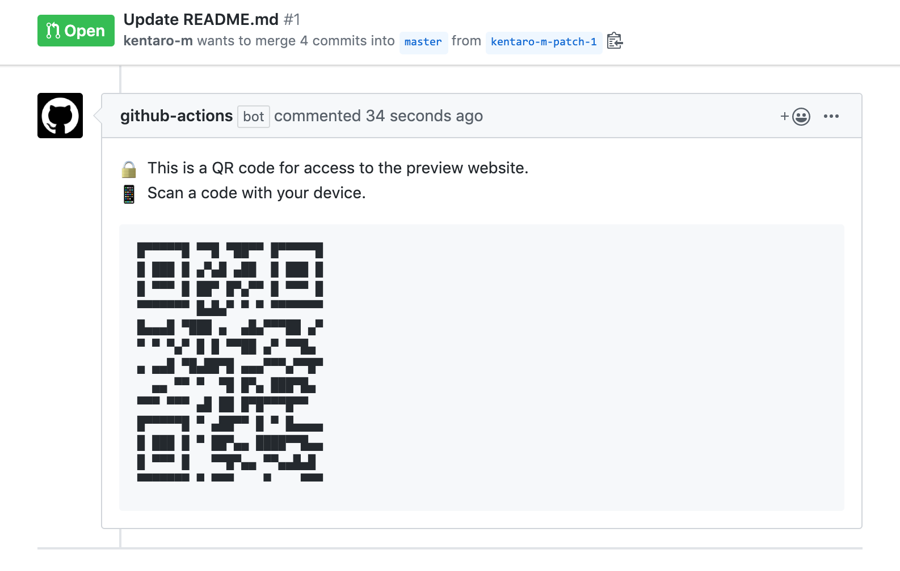

# QR Code Commenter
A GitHub Action that posts a QR code to a pull request comment.



## :arrow_forward: Usage
```yml
uses: kentaro-m/qr-code-commenter-action@v0.1.1
with:
  repo-token: "${{ secrets.GITHUB_TOKEN }}"
  content: https://blog.kentarom.com/
  comment: |
    :lock: This is a QR code for access to the preview website.
    :iphone: Scan a code with your device.
    {qrcode}
```

### Set up required parameters
Need to contain the required parameters on the workflow file.

- `repo-token` Token for the repository. Can be passed in using `{{ secrets.GITHUB_TOKEN }}`
- `content` The content to encode to QR code. Must be string.
- `comment` The body for comment to post to a pull request comment. Must be contained `{qrcode}` placeholder and placed it to a new line.

### Use a text outputted from the other action as input
You can use a text outputted from the other action as input.

Check the following page about the detail of `outputs` syntax: [Metadata syntax for GitHub Actions - GitHub Help](https://help.github.com/en/actions/building-actions/metadata-syntax-for-github-actions#outputs)

```yml
uses: kentaro-m/qr-code-commenter-action@v0.1.1
with:
  repo-token: "${{ secrets.GITHUB_TOKEN }}"
  # Use a text outputted from the other action
  content: "${{ steps.deploy.outputs.preview_url }}"
  comment: |
    :lock: This is a QR code for access to the preview website.
    :iphone: Scan a code with your device.
    {qrcode}
```

## :memo: Licence
MIT
